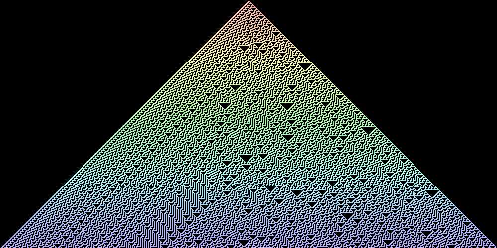
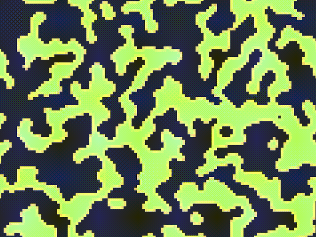
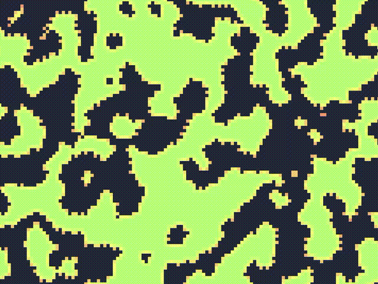
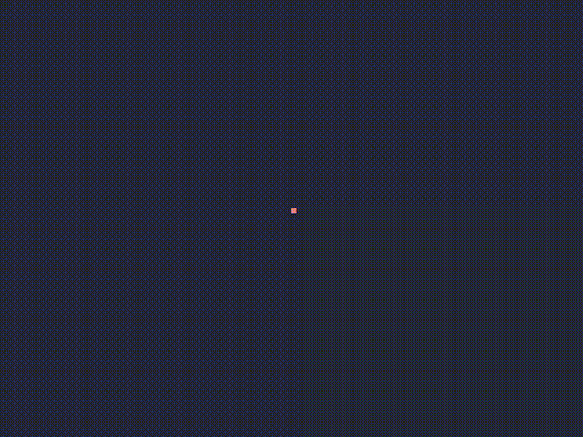
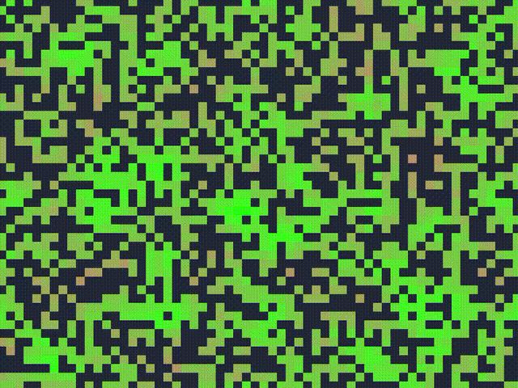
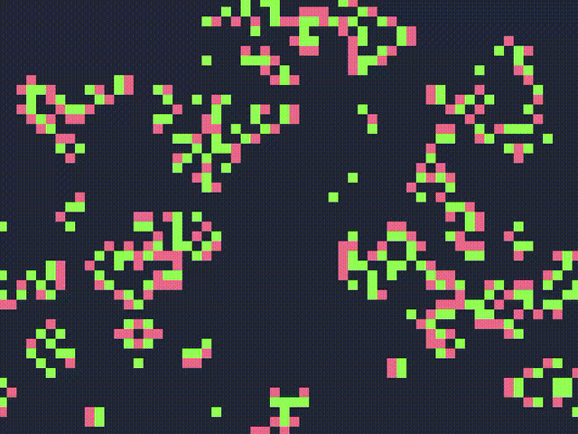

# What is This?

It's kind of a Cellular Automata Journal where I document my adventures in Cellular Auotmata land.

> [!IMPORTANT]
> All examples are written in python (version >= 3.10) and depend on the [pygame library](https://www.pygame.org/)

# Screenshots

## Elementary Cellular Automata

Here are a few configurations (known as rules) I found interesting. In order they are rules 30 90, 110, 150, 182, 190, 220.

## Some Totalistic Celluar Automata

### Vote (or Majority)

### Vote (4 over 5)

### Fredkin (Replicator)

## Game of Life

## Brian's Brain

### Variations

#### NLU 512

[^1]

#### NLU 514

## BrainLife

### Cooties

### Faders

### RainZha

# Resources

Here is a list of all the resources I drew upon to learn about Cellular Automata:

- https://www.fourmilab.ch/cellab/manual/chap4.html
- https://conwaylife.com/wiki/
- https://mathworld.wolfram.com/ElementaryCellularAutomaton.html

Footnotes
[^1]: The name follows the NLUKY generalization of Life and Brain CA described [here.](https://www.fourmilab.ch/cellab/manual/chap4.html#i4-TH-semit)
